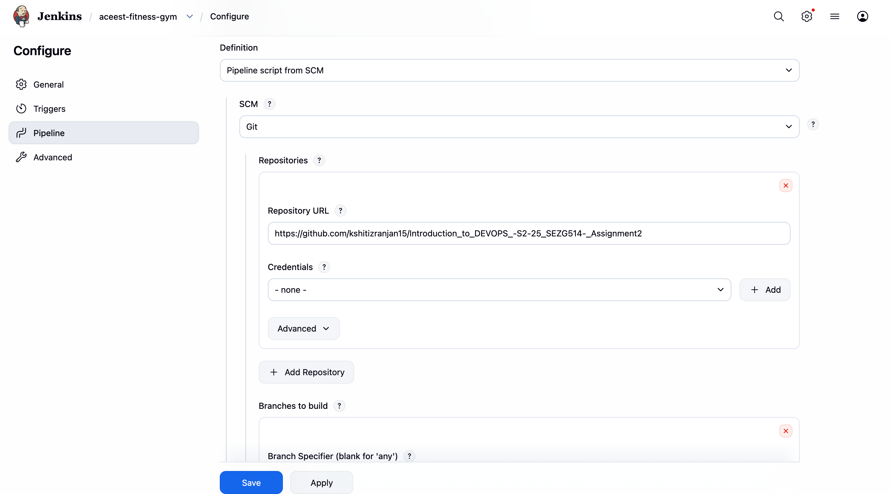
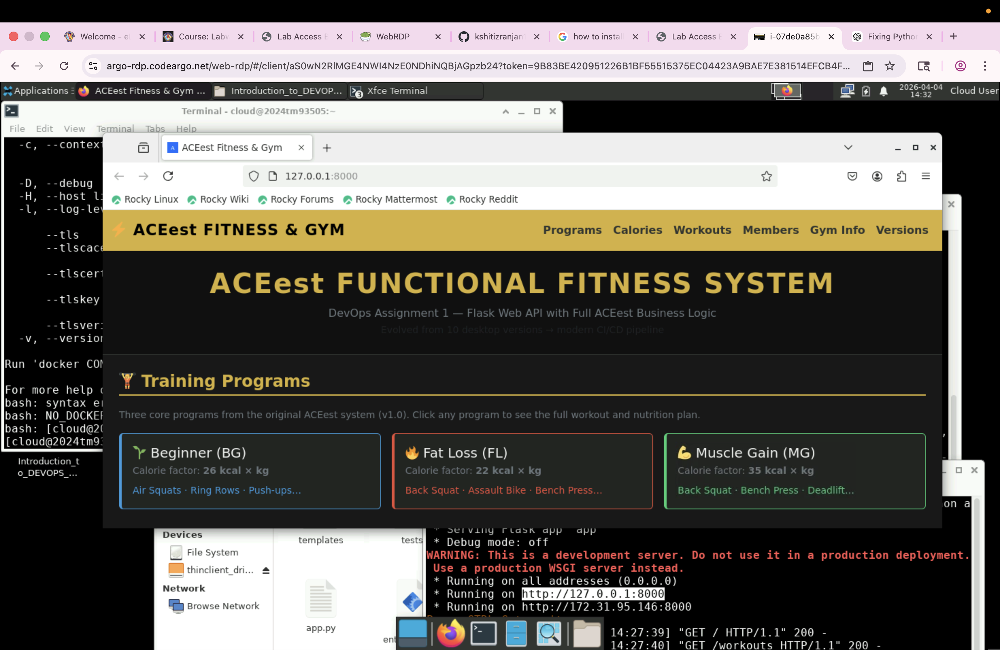
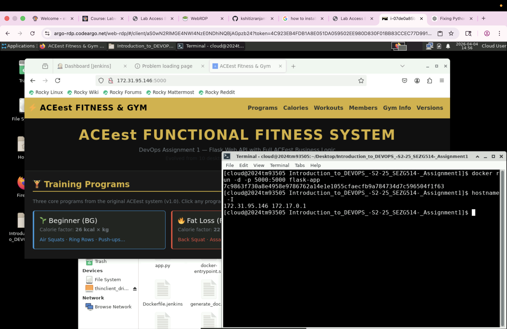

# ACEest — Assignment 2: CI/CD, Quality Gates & Kubernetes Delivery

This repository contains the Assignment‑2 deliverables for the ACEest Fitness & Gym project. It focuses on implementing
CI/CD best practices, static analysis (SonarQube), container registry integration, and validating deployment manifests on a
Kubernetes cluster (Minikube / lab cluster). This README is a self-contained runbook for reviewers and graders.

## What this repository contains (quick)

- `k8s/` — Kubernetes manifests (Deployment, Service) for demo deployment.
- `scripts/` — helper scripts (e.g., `deploy_k8s.sh`).
- `sonar-project.properties` — SonarQube project configuration.
- `docker-compose.sonarqube.yml` — quick SonarQube demo stack.
- `Makefile` — convenience targets (`sonar-up`, `build-image`, `minikube-start`, `deploy-k8s`, ...).
- `sonar-scan.sh` — helper to run the Sonar scanner with host detection (optional).

## Objective & Deliverables (Assignment requirements)

Objective: demonstrate an automated, trustworthy CI/CD delivery pipeline that runs tests, performs static analysis,
publishes a container image to a registry, and deploys to a Kubernetes cluster with simple rollout controls.

Deliverables in this repo:
- Automated CI workflow (GitHub Actions) that runs unit tests and Sonar scan.
- A Jenkins pipeline (example `Jenkinsfile`) demonstrating local BUILD and deploy stages.
- `sonar-project.properties` for Sonar analysis and `docker-compose.sonarqube.yml` to run Sonar locally.
- Kubernetes manifests in `k8s/` and a helper `scripts/deploy_k8s.sh` for image patch and rollout.

## Quick prerequisites

- Git (to push this repo to GitHub)
- Docker Desktop (or Colima) for local Docker daemon
- Minikube and kubectl (for local k8s validation)

## Table of Contents

1. [Assignment Context & Background](#assignment-context--background)
2. [Learning Objectives](#learning-objectives)
3. [Assignment Deliverables](#assignment-deliverables--requirements)
4. [Runbook — Quick Start](#runbook--quick-start-for-assignment-2)
5. [Deployment Strategies](#deployment-strategies--how-to-demonstrate)
6. [CI Integration & Testing](#ci-integration--testing--coverage)
7. [Submission Checklist & Grading](#submission-checklist)
8. [Running Services Locally](#running-the-assignment-2-services-locally)
9. [Assignment 1 Reference & Evidence](#assignment-1-reference-and-foundational-evidence)

---

## Assignment Context & Background

**Course:** Introduction to DEVOPS (CSIZG514 / SEZG514) — Semester 2, 2025

**Student:** Kshitiz Ranjan (Roll: 2024TM93505)  
**Institution:** BITS Pilani, Work Integrated Learning Programme (WILP)

### Assignment Rationale

In modern software organizations, automation, testing, and continuous delivery are essential. This assignment builds a repeatable, test-driven CI/CD pipeline integrating code-quality checks, automated tests, container builds, image publishing, and Kubernetes deployments.

**Baseline:** The application source from Assignment 1 serves as the functional baseline. Assignment 2 focuses on automation and DevOps practices, not application changes.

**Reference — Assignment 1:**  
https://github.com/kshitizranjan15/Introduction_to_DEVOPS_-S2-25_SEZG514-_Assignment1

### Learning Objectives
By the end of this assignment you will be able to:
1. Apply DevOps principles to design and implement a fully automated CI/CD pipeline.
2. Demonstrate proficiency with: Git/GitHub, Jenkins, Pytest, SonarQube, Docker (or Podman), Docker Hub (or equivalent),
   and Kubernetes (Minikube / cloud).
3. Integrate automated testing and static analysis into the pipeline so quality gates are enforced.
4. Implement deployment strategies that support zero‑downtime and safe rollback (rolling, blue/green, canary).
5. Produce documentation and evidence (logs, screenshots, URLs) showing the pipeline, Sonar results and successful deploys.

Expected learning outcomes
--------------------------
- Build an end‑to‑end automated DevOps pipeline that validates, packages and deploys the application.
- Integrate tests and quality gates into automation.
- Demonstrate rollback and progressive release strategies.
- Learn how containerization and orchestration stabilize delivery across environments.

### Assignment Deliverables & Requirements

1) Application & Tests
- Keep the ACEest application sources (from Assignment‑1). Include Pytest unit tests in `tests/` covering API and business logic.

2) Version control & branching
- Initialize Git and push to GitHub (Assignment‑2 repo). Use feature branches and meaningful commit messages. Tag releases.

3) Unit testing & automation
- Implement Pytest tests and integrate execution into CI. Produce `coverage.xml` using `pytest-cov`.

4) Jenkins (BUILD server)
- Provide a `Jenkinsfile` (Declarative) that:
  - Checks out the repository
  - Creates a Python venv and installs deps
  - Runs unit tests and produces coverage
  - Runs Sonar analysis (with token)
  - Builds Docker image and (optionally) pushes to the registry
  - Optionally deploys to k8s (guarded by branch or manual approval)

5) Containerization & registry
- Build a Docker image with a pinned `requirements.txt`. Tag images with semantic versions.
- Push images to Docker Hub (or another registry) and document the image repo.

6) Kubernetes deployment strategies
- Provide `k8s/` manifests and demonstrate (or document) how to use:
  - Rolling updates (default `kubectl` behavior)
  - Blue/Green deployment (two services/deployments and traffic switch)
  - Canary release (small subset of traffic to new version)
  - Shadow / A/B testing concepts
- Provide rollback scripts/commands (`kubectl rollout undo`) and smoke tests that detect failures and trigger rollback.

7) SonarQube and quality gates
- Add `sonar-project.properties`. Configure CI/Jenkins to run Sonar analysis and fail builds on quality gate failures.

8) Documentation & report
- A short report (2–3 pages) describing architecture, pipeline, deployment strategies, challenges and results.

Runbook — quick practical steps
------------------------------
This section contains copy‑paste commands to get your demo environment running locally (sonar, minikube, build & deploy).

Prerequisites
- Git, Docker (or Colima), Python 3.11+, Minikube & kubectl, Jenkins (optional).

Start SonarQube (local demo)
```bash
# start Sonar using the provided compose file (or use Makefile target)
make sonar-up
# or
docker compose -f docker-compose.sonarqube.yml up -d
```
Open http://localhost:9000 and sign in using the local SonarQube administrator account. Change any default
passwords immediately and create a scoped token for automated scans.

For automation, generate a Sonar scanner token in the SonarQube UI and store it securely in your CI or pipeline
credential store. For local scans you may authenticate interactively or provide the token to the scanner via an
environment variable in your shell session — do not hardcode tokens in files or commit them to source control.

Run Sonar scan

For local Sonar scans, authenticate interactively in the Sonar UI or provide a scanner token in your shell session.
For CI, inject the scanner token via your CI provider's secret store and reference it at runtime in the scanner step.
Do not hardcode or commit tokens in any files or scripts.

Minikube — build and deploy
```bash
minikube start --driver=docker
eval "$(minikube -p minikube docker-env)"
docker build -t aceest:local .
kubectl apply -f k8s/deployment.yaml
kubectl apply -f k8s/service.yaml
kubectl rollout status deployment/aceest-deployment
minikube service aceest-service
```

Jenkins configuration

Use Jenkins' Credentials store to securely add any authentication material required for pushes, scans or cluster
access. Add registry credentials, Sonar scanner tokens, and kubeconfig or cluster-access material to Jenkins' secure
credential store and reference those credentials from your pipeline at runtime. Avoid printing secret values in logs
or committing them to the repository.

GitHub Actions & secrets

Configure required secrets in your chosen CI provider using the provider's secure secrets/credentials feature. Reference
those secrets only at runtime in workflows or pipeline steps. Suggested job flow: tests → sonar → build & push (on
`main`) → deploy (manual or protected `main`).

sonar-project.properties (example)
```
sonar.projectKey=aceest-assignment2
sonar.projectName=ACEest Assignment 2
sonar.sources=.
sonar.language=py
sonar.python.version=3.11
sonar.coverageReportPaths=coverage.xml
```

## Deployment Strategies — How to Demonstrate

- **Rolling update:** Change image tag and use `kubectl rollout status` to show progressive pod replacement.
- **Blue/Green:** Run parallel deployments (v1 and v2) and switch Service selector or update Ingress.
- **Canary:** Deploy a small replica set of v2 and route a fraction of traffic (using ingress or manual test).
- **Shadow/A‑B Testing:** Mirror requests to a secondary endpoint for validation without affecting user traffic.
- **Rollback:** Demonstrate `kubectl rollout undo deployment/aceest-deployment` and automated health checks.

## CI Integration — Testing & Coverage

Generate test reports and code coverage for Sonar analysis:

```bash
pytest --junitxml=reports/junit.xml --cov=./ --cov-report=xml:coverage.xml -q
```

Pass the `coverage.xml` to the Sonar scanner so code coverage metrics appear in the SonarQube dashboard.

## Submission Checklist

Ensure your repository submission contains:

**Code & Artifacts:**
- Application source files (ACEest Flask app)
- `tests/` with pytest test cases (minimum 5 tests)
- `Dockerfile` and image build instructions
- `Jenkinsfile` (Declarative pipeline)
- `k8s/` manifests and `scripts/deploy_k8s.sh`
- `sonar-project.properties` for quality analysis
- `.github/workflows/` CI workflow(s) if implemented

**Documentation & Evidence:**
- GitHub repository URL (public or with reviewer access)
- Docker Hub repository URL with tagged images
- SonarQube project link or dashboard screenshots
- Jenkins build logs or screenshots showing successful pipeline runs
- Kubernetes/Minikube deployment screenshots demonstrating the chosen strategy

**Report:**
- 2–3 page summary covering:
  - Pipeline architecture and component interactions
  - Deployment strategies chosen and why
  - Key challenges and solutions
  - Test results and code quality metrics
  - Evidence of successful CI/CD execution

## Grading Criteria

Reviewers will evaluate:

- ✅ **Functional tests:** All unit tests pass; CI builds successfully
- ✅ **Quality gates:** SonarQube configured and passing (or technical debt documented)
- ✅ **Container images:** Versioned tags pushed to registry
- ✅ **Deployment:** Strategies demonstrated and rollback tested
- ✅ **Documentation:** Clear README and 2–3 page report

---

## Screenshots & Evidence

### Version Control: Git and GitHub


*Figure: Git repository initialized and pushed to GitHub with version control strategy*

### Build Automation: Jenkins


*Figure: Jenkins pipeline dashboard showing the complete CI/CD workflow*

---

## Running the Assignment 2 Services Locally

### 1. SonarQube (Static Analysis & Quality Gates)

Purpose: Static analysis and quality gate validation. A local SonarQube instance enables demonstration before integrating a hosted Sonar server.

Quick start (requires Docker):


```bash
# Start SonarQube using the provided compose file
make sonar-up
# OR manually:
docker compose -f docker-compose.sonarqube.yml up -d
```

Access SonarQube at http://localhost:9000 and sign in. Change any default account credentials immediately and create a scoped token for automated scans.

For CI automation, store scanner tokens securely in your CI provider's secret store. Reference tokens at runtime only — never hardcode or commit them to source control.

### 2. Minikube (Local Kubernetes Cluster)   - Quick start (macOS with Homebrew):

   ```bash
   # install and start minikube (one-time)
   brew install minikube kubectl
   minikube start --driver=docker

   # use the host Docker daemon for faster image testing (optional)
   eval "$(minikube -p minikube docker-env)"

   # from the repo root: build the image using the same tag the deploy script expects
   docker build -t aceest:local .

   # update and apply manifests from the repo
   kubectl apply -f k8s/deployment.yaml
   kubectl apply -f k8s/service.yaml

   # wait for rollout
   kubectl rollout status deployment/aceest-deployment -n default
   kubectl get svc aceest-service -o wide
   ```

   - Notes: if you prefer, `scripts/deploy_k8s.sh` can patch the Deployment image and wait for rollout. When using
     Minikube you may expose the service with `minikube service aceest-service` or enable an ingress controller.

3) Jenkins credentials & configuration

Add any credentials required for registry pushes, Sonar scanning, or cluster access to Jenkins' secure credential store.
Reference those credentials in your `Jenkinsfile` using the `credentials()` helper or the appropriate plugin. Keep
secrets out of source control and avoid exposing them in build logs. For cluster deployments, either run `kubectl` on an
agent that already has cluster credentials or provision a pod with the required access via a secure method supported
by your infrastructure.

### Jenkins Setup for Assignment 2

Jenkins provides automated BUILD and deployment orchestration. This section documents the Jenkinsfile pipeline and how to run Jenkins locally.

**What the Pipeline Does:**
- Checkout code from GitHub
- Setup Python environment with dependencies
- Run linting and syntax checks
- Execute pytest unit tests with coverage
- Run SonarQube code quality analysis
- Build Docker image with versioning
- Test application inside container
- Push image to Docker Hub (optional)
- Deploy to Kubernetes cluster (optional)
- Run smoke tests

**Running Jenkins Locally:**

```bash
# Build custom Jenkins image
docker build -f Dockerfile.jenkins -t aceest-jenkins:local .

# Run Jenkins container
docker run -d \
  --name aceest-jenkins \
  -p 8080:8080 \
  -p 50000:50000 \
  -v /var/run/docker.sock:/var/run/docker.sock \
  -v jenkins_home:/var/jenkins_home \
  aceest-jenkins:local
```

Access at http://localhost:8080. Retrieve initial admin password with:
```bash
docker exec aceest-jenkins cat /var/jenkins_home/secrets/initialAdminPassword
```

**Jenkins Job Configuration:**
1. Create a new Pipeline job named `aceest-assignment2`
2. Configure "Pipeline script from SCM" (Git)
3. Repository: `https://github.com/kshitizranjan15/Introduction_to_DEVOPS_-S2-25_SEZG514-_Assignment2.git`
4. Branch: `main`
5. Script path: `Jenkinsfile`
6. Enable GitHub hook trigger (if webhooks are configured)

**Jenkinsfile Stages:**

| Stage | Purpose |
|-------|---------|
| Checkout | Pull latest code from Git |
| Setup Python | Create venv and install dependencies |
| Lint & Syntax Check | Validate Python syntax |
| Unit Tests | Run pytest and generate coverage |
| SonarQube Analysis | Code quality scanning |
| Build Docker Image | Create container image with version tag |
| Test Inside Container | Run pytest inside built image |
| Push to Registry | Push to Docker Hub (main branch only) |
| Smoke Test | Validate health endpoint |

**Required Credentials in Jenkins:**
- `dockerhub-creds` — Docker Hub credentials (optional)
- `github-token` — GitHub PAT (optional, for status updates)

---

## Files Added for Assignment 2

---

## Objective

This assignment provides comprehensive, hands-on experience in modern DevOps methodologies. By executing this project, students attain professional proficiency in:

- **Version Control** — Git and GitHub
- **Containerization** — Docker
- **CI/CD Orchestration** — GitHub Actions and Jenkins

---

## Assignment Phases

### Phase 1 — Application Development & Modularization

Develop a foundational Flask web application tailored for fitness and gym management, built on baseline Python scripts that initialise core logic and service endpoints.

**Implemented endpoints:**

| Method | Endpoint    | Purpose                            | Status |
|--------|-------------|------------------------------------|--------|
| GET    | `/`         | Service sanity check / browser UI | 200    |
| GET    | `/health`   | Health check for monitoring        | 200    |
| GET    | `/workouts` | List all workouts                  | 200    |
| POST   | `/workouts` | Create a new workout               | 201    |
| GET    | `/members`  | List all members                   | 200    |
| POST   | `/members`  | Create a new member                | 201    |

**Design decisions:**
- **`create_app()` factory pattern** — the application can be instantiated cleanly in tests without global application state, making tests deterministic and independent.
- **In-memory stores** (`app.config["WORKOUTS"]`, `app.config["MEMBERS"]`) — keeps scope focused on DevOps concerns; easily replaceable with a persistent database in a later iteration.
- **Browser-aware root endpoint** — detects `Accept: text/html` to serve a Bootstrap UI (`templates/index.html`), while returning JSON to API clients and to the pytest test client (which sends no `Accept` header).
- **Input validation** — POST endpoints return `400 Bad Request` with a descriptive error message when required fields are missing or malformed.

---

### Phase 2 — Version Control System (VCS) Strategy

A Git repository was initialised locally and pushed to a publicly accessible GitHub repository using proper branching and commit conventions.

**Repository:**
[https://github.com/kshitizranjan15/Introduction\_to\_DEVOPS\_-S2-25\_SEZG514-\_Assignment1](https://github.com/kshitizranjan15/Introduction_to_DEVOPS_-S2-25_SEZG514-_Assignment1)

**Branching strategy:**

| Branch type       | Naming convention      | Purpose                         |
|-------------------|------------------------|---------------------------------|
| Stable production | `main`                 | Always deployable; CI must pass |
| Feature dev       | `feature/<short-desc>` | New features (merged via PR)    |
| Bug fixes         | `fix/<short-desc>`     | Bug corrections                 |
| Infrastructure    | `ci/<short-desc>`      | CI/CD or Dockerfile changes     |

**Commit message convention (Conventional Commits):**

```
feat(api): add POST /workouts endpoint
fix(validation): return 400 when email has no @ symbol
ci(actions): load Docker image into runner before docker run
docs(readme): add student details and assignment problem statement
```

---

### Phase 3 — Unit Testing & Validation Framework

Pytest is used to implement a suite of unit tests that validate application logic **before** the build stage. Tests act as an automated quality gate — broken logic cannot pass CI.

**File:** `tests/test_app.py`
**Setup:** `tests/conftest.py` — prepends the repository root to `sys.path` so pytest can import `app` without manually configuring `PYTHONPATH`.

**Tests implemented:**

| Test name                     | What it validates                                                        |
|-------------------------------|--------------------------------------------------------------------------|
| `test_index_and_health`       | Root returns 200 with `status: ok`; `/health` returns `status: healthy` |
| `test_create_and_get_workout` | POST /workouts creates a record; GET /workouts lists it                  |
| `test_workout_validation`     | POST /workouts with missing `duration_minutes` returns 400              |
| `test_create_and_get_member`  | POST /members creates a record; GET /members lists it                   |
| `test_member_validation`      | POST /members with invalid email returns 400                            |

**Confirmed test result (local execution):**

```
5 passed in 0.14s
```

---

### Phase 4 — Containerization with Docker

The Flask application, its dependencies, and its runtime environment are fully encapsulated in a portable Docker image.

**Dockerfile strategy:**

| Layer                   | Detail                                                                         |
|-------------------------|--------------------------------------------------------------------------------|
| Base image              | `python:3.11-slim` — minimal footprint, reduced attack surface                 |
| Environment variables   | `PYTHONUNBUFFERED=1`, `PIP_NO_CACHE_DIR=off`                                  |
| Dependency installation | Pinned `requirements.txt` for reproducible builds                              |
| Production runtime      | `gunicorn` (WSGI server, not the Werkzeug dev server)                         |
| Exposed port            | `5000`                                                                         |
| Tests in image          | `tests/` is **not** excluded from `.dockerignore` so `pytest` runs in CI      |

**Build and run:**

```bash
# Build the image
docker build -t aceest:local .

# Run the application (http://localhost:5000)
docker run --rm -p 5000:5000 aceest:local

# Run tests inside the container (mirrors CI)
docker run --rm aceest:local pytest -q
```

---

### Phase 5 — Jenkins BUILD & Quality Gate

A **Declarative Jenkins Pipeline** (`Jenkinsfile`) is provided at the repository root. Jenkins serves as a secondary automated validation layer — on every push it pulls the latest code, installs dependencies in a clean virtual environment, executes the test suite, and builds the Docker image.

**Jenkins runs locally inside Docker using a custom image (`aceest-jenkins:local`):**

```bash
docker run -d \
  --name aceest-jenkins \
  -p 8080:8080 \
  -v /var/run/docker.sock:/var/run/docker.sock \
  -v jenkins_home:/var/jenkins_home \
  aceest-jenkins:local
```

**Pipeline stages:**

| Stage                     | Action                                                       |
|---------------------------|--------------------------------------------------------------|
| **Checkout**              | `checkout scm` — pull latest commit from GitHub              |
| **Setup Python**          | `python3 -m venv .venv`, `pip install -r requirements.txt`  |
| **Lint / Syntax Check**   | `python -m compileall .`                                    |
| **Unit Tests**            | `pytest -q`                                                 |
| **Build Docker Image**    | `docker build -t aceest:build-N .`                          |
| **Test Inside Container** | `docker run --rm aceest:build-N pytest -q`                  |

---

### Phase 6 — Automated CI/CD Pipeline via GitHub Actions

**Workflow file:** `.github/workflows/main.yml`

The pipeline triggers on **every push and pull request** to any branch, providing instant feedback to the developer.

**Pipeline architecture:**

```
Push / Pull Request
       |
       v
+---------------------+   passes   +--------------------------+
|   build-and-test    | ---------> |  docker-build-and-test   |
+---------------------+            +--------------------------+
```

**Job 1: `build-and-test`**

| Step                 | Action                              |
|----------------------|-------------------------------------|
| Checkout code        | `actions/checkout@v4`               |
| Set up Python 3.11   | `actions/setup-python@v4`          |
| Install dependencies | `pip install -r requirements.txt`   |
| Syntax / lint check  | `python -m compileall .`            |
| Run unit tests       | `pytest -q`                         |

**Job 2: `docker-build-and-test`** *(depends on job 1)*

| Step                       | Action                                                  |
|----------------------------|---------------------------------------------------------|
| Checkout code              | `actions/checkout@v4`                                   |
| Set up Docker Buildx       | `docker/setup-buildx-action@v2`                        |
| Build Docker image         | `docker/build-push-action@v4` with **`load: true`**    |
| Run tests inside container | `docker run --rm aceest:ci pytest -q`                  |

> **Why `load: true`?** Docker Buildx builds into a build cache but does not load the image into the runner's local Docker daemon by default. Without `load: true`, `docker run aceest:ci` fails with _"Unable to find image"_. This flag ensures the image is available for subsequent `docker run` steps in the same job.

---

## Required Deliverables — Status

| Deliverable                                 | Status                        |
|---------------------------------------------|-------------------------------|
| Flask application with all endpoints        | ✅ Complete                   |
| Version-controlled Git repository on GitHub | ✅ Complete                   |
| Pytest unit tests (5 tests, all passing)    | ✅ Complete                   |
| `Dockerfile` and `.dockerignore`            | ✅ Complete                   |
| `Jenkinsfile` (Declarative pipeline)        | ✅ Complete                   |
| GitHub Actions workflow (push + PR trigger) | ✅ Complete                   |
| Browser UI for manual testing               | ✅ Complete (Bootstrap 5.3.2) |
| README / Project Report                     | ✅ Complete                   |

---

## Assignment 1: Reference and Foundational Evidence

The following section documents Assignment 1 (the baseline CI/CD work). This is provided for context and as a reference implementation showing how the Flask application was developed and initial CI/CD automation was established.

### CI/CD Pipeline — Live Evidence (Screenshots — Assignment 1)

The following screenshots document the complete end-to-end CI/CD journey — from the first push to GitHub, through GitHub Actions running in the cloud, to the Jenkins pipeline running locally in Docker. Each screenshot captures a distinct, significant milestone in the pipeline lifecycle.

---

### Screenshot 1 — First Push to GitHub: CI Check In Progress


**What this shows:**
Immediately after the very first `git push` to `main`, GitHub detects the `.github/workflows/main.yml` file and triggers the **CI / build-and-test** job automatically. The yellow dot next to commit `07c132d` indicates the check is **in progress**. The pop-up tooltip reads *"1 in progress check — CI / build-and-test (push) — In progress — This check has started..."*.

**Key DevOps concept — Continuous Integration trigger:**
This is the GitHub Actions webhook firing in real time. Every push to any branch triggers the workflow without any manual intervention, giving the developer immediate automated feedback directly on the GitHub commit view.

**Pipeline state at this point:**
```
git push  -->  GitHub webhook fires  -->  Actions runner provisioned  -->  Job 1 started
```

---

### Screenshot 2 — Second Commit Pushed: Unit Test Failure Detected


**What this shows:**
A second commit (`307ebf6`) was pushed with the message *"S2-25_SEZG514:correcting unit test failing issue"*. The yellow dot shows GitHub Actions has been triggered again for this new push. This captures the iterative fix cycle — the developer identified a failing test from the first run and pushed a corrective commit immediately.

**Key DevOps concept — Shift-left testing and iterative fixing:**
A test failure was caught by CI (not discovered in production), fixed locally, and re-pushed within minutes. The automated pipeline acts as a safety net that enforces quality on every single commit — not just at release time.

---

### Screenshot 3 — GitHub Actions: Unit Tests Pass, Docker Job Fails


**What this shows:**
The GitHub Actions run for commit `307ebf6` shows a split result:
- ✅ **`build-and-test`** — succeeded in **6 seconds**. All 5 pytest tests passed.
- ❌ **`docker-build-and-test`** — failed. The Docker in-container test step errored.

The expanded **Run tests (pytest)** step clearly shows:
```
Run pytest -q
.....    [100%]
5 passed in 0.13s
```

**Key DevOps concept — Two-stage fail-fast pipeline:**
The pipeline runs unit tests before Docker operations. Here, unit tests pass, allowing execution to reach the Docker stage where a separate issue is isolated. The two stages correctly diagnosed two independent problems without conflating them.

**Root cause of Docker failure:** The `.dockerignore` was excluding the `tests/` directory, so `pytest` inside the container could not find test files. Fixed by removing `tests` from `.dockerignore`.

---

### Screenshot 4 — GitHub Actions: Docker Job Passes


**What this shows:**
After fixing the `.dockerignore` issue, the `docker-build-and-test` job now passes in **31 seconds**. All steps are green:

| Step                                  | Status | Time |
|---------------------------------------|--------|------|
| Set up job                            | ✅     | 4s   |
| Checkout                              | ✅     | 0s   |
| Set up QEMU                           | ✅     | 5s   |
| Set up Docker Buildx       | ✅     | 5s   |
| Build Docker image                   | ✅     | 12s  |
| Run tests inside container            | ✅     | 1s   |
| Post Build Docker image               | ✅     | 0s   |

**Key DevOps concept — Environment parity:**
The Docker build and in-container test confirm the application works identically inside the container as it does locally, eliminating the classic "works on my machine" problem.

**Fix applied:** `load: true` was added to `docker/build-push-action@v4`. Without it, Buildx builds into an isolated cache but does **not** load the image into the runner's Docker daemon, causing `docker run aceest:ci` to fail with *"Unable to find image"*.

---

### Screenshot 5 — GitHub Green Checkmark on Commit


**What this shows:**
The GitHub repository home page showing a **green checkmark** next to the latest commit — *"S2-25_SEZG514:correcting docker test failing issue #3"*. This is visual confirmation that **both CI jobs passed** for this commit. The repository now shows **4 commits** total.

**Key DevOps concept — Green build as quality gate:**
The green checkmark is the artefact of CI — proof, visible to every team member, that this exact commit has passed all automated quality checks. In a production environment, this status gates deployments: no green means no deploy.

---

### Screenshot 6 — Jenkins: Configure Pipeline (SCM from GitHub)


**What this shows:**
The Jenkins job `aceest-fitness-gym` configured with **"Pipeline script from SCM"** — Jenkins pulls the `Jenkinsfile` directly from the GitHub repository. Key settings visible:

- **SCM:** Git
- **Repository URL:** `https://github.com/kshitizranjan15/Introduction_to_DEVOPS_-S2-25_SEZG514-_Assignment1`
- **Credentials:** None (public repository)
- **Branch Specifier:** `*/main`

**Key DevOps concept — Pipeline as Code:**
By storing the `Jenkinsfile` in Git, the pipeline definition is version-controlled alongside the application code. Any change to the build process goes through the same commit and review workflow as application changes — eliminating undocumented, click-configured Jenkins jobs that cannot be reproduced or audited.

**How Jenkins was set up locally:**
Jenkins runs inside Docker using a custom image (`aceest-jenkins:local`) built from `Dockerfile.jenkins`. The container mounts the host Docker socket so Jenkins can execute Docker commands. A custom `docker-entrypoint.sh` automatically runs `chmod 666 /var/run/docker.sock` on every container start to fix the Docker socket permission issue.

---

### Screenshot 7 — Jenkins: Stage View — All Builds History


**What this shows:**
The Jenkins **Stage View** for the `aceest-fitness-gym` job showing **8 build runs** (builds #1 through #8). Builds #7 and #8 are both green (successful). The Stage View columns map directly to the stages in the `Jenkinsfile`:

| Stage                     | Avg Time | Purpose                                           |
|---------------------------|----------|---------------------------------------------------|
| Declarative: Checkout SCM | 1s       | Jenkins internal SCM initialisation               |
| Checkout                  | 958ms    | `checkout scm` — pull latest commit from GitHub   |
| Setup Python              | 5s       | `python3 -m venv .venv`, `pip install -r requirements.txt`  |
| Lint / Syntax Check       | 295ms    | `python -m compileall .` — catch syntax errors    |
| Unit Tests                 | 344ms    | `pytest -q` — run all 5 tests                     |
| Build Docker Image        | 7s       | `docker build -t aceest:build-N .`                |
| Test Inside Container     | 451ms    | `docker run --rm aceest:build-N pytest -q`        |
| Declarative: Post Actions | 342ms    | Workspace cleanup via `cleanWs()`                 |

Build #7 tooltip shows commit `657313e` ("S2-25_SEZG514:Docker update") — demonstrating full traceability from Jenkins build number back to the exact Git commit hash.

**Earlier failed builds (#1–#6) represent the debugging journey:**

| Build | Failure reason                                | Fix applied                                  |
|-------|-----------------------------------------------|----------------------------------------------|
| #1–#2 | `permission denied` on Docker socket         | `docker-entrypoint.sh` auto-runs `chmod 666` |
| #3    | `fatal: not in a git directory`              | Disabled lightweight checkout via Jenkins API|
| #4–#6 | Groovy `unexpected token: } @ line 214`      | Rewrote `Jenkinsfile` — removed duplicate block |
| #7–#8 | All stages green ✅                           | —                                            |

---

### Screenshot 8 — GitHub Final Green Commit (All CI Passing)


**What this shows:**
The GitHub repository after **11 commits** with the latest commit `657313e` — *"S2-25_SEZG514:Docker update"* — showing a **green checkmark**. At this point, both GitHub Actions jobs and the Jenkins pipeline are all passing successfully.

**The full 11-commit journey:**

| #     | Commit message                                        | What it fixed / introduced                    |
|-------|-------------------------------------------------------|-----------------------------------------------|
| 1     | S2-25_SEZG514:commiting assignment code base          | Initial push — Flask app, Dockerfile, Actions |
| 2     | S2-25_SEZG514:correcting unit test failing issue      | Fixed `conftest.py`, pinned `Werkzeug==2.3.7` |
| 3     | S2-25_SEZG514:correcting docker test failing issue #1 | Added `load: true` to Actions workflow        |
| 4     | S2-25_SEZG514:correcting docker test failing issue #2 | Fixed `.dockerignore` (kept `tests/`)         |
| 5     | S2-25_SEZG514:correcting docker test failing issue #3 | Verified Docker + pytest chain passes         |
| 6–10  | Various Jenkins fixes                                 | Socket perms, checkout, Groovy syntax errors  |
| 11    | S2-25_SEZG514:Docker update                           | Final clean pipeline — all green ✅           |

---

### Screenshot 9 — GitHub Commit Line Final State


**What this shows:**
A close-up of the GitHub repository commit line showing the latest commit on `main` with a **green checkmark** — confirming the repository is in a fully passing state. This is the definitive evidence of a working, automated CI/CD pipeline integrated with GitHub.

**Summary of what this green tick represents:**
- Every code change was automatically tested — no manual testing required
- The Docker image was built and validated in an isolated container environment
- Jenkins independently verified the same build pipeline from a local Docker container
- The repository is in a deployable state — any team member can pull `main` and trust it works

---

### Screenshot 10 — Live App: Root View (Part 1 — Hero + Programs)


**What this shows:**
The live Flask web application running in a browser at `http://localhost:5000`. The top of the page displays the **gold ACEest navbar**, the hero banner introducing the system, and the **Training Programs section** with three colour-coded cards — 🔥 Fat Loss (FL), 💪 Muscle Gain (MG), and 🌱 Beginner (BG). Each card shows the calorie factor and top exercises drawn directly from the original Tkinter version files (v1.0 through v3.2.4).

---

### Screenshot 11 — Live App: Root View (Part 2 — Program Detail Expanded)


**What this shows:**
A program card has been clicked, expanding the **program detail panel** below the cards. Two side-by-side dark boxes display the full weekly **Workout Plan** and the **Nutrition Plan** for the selected program — content fetched live from the `GET /programs/<code>` endpoint. This mirrors the original desktop app's workout/diet display tab from Aceestver-1.0 onwards, now delivered as a REST API response.

---

### Screenshot 12 — Live App: Root View (Part 3 — Workouts & Members)


**What this shows:**
The **Workout Log** section (left) and **Members** section (right) in the dark-themed UI. Both sections show live-updating lists fed by `GET /workouts` and `GET /members`, with a badge count in the card header. The forms on the right allow logging a new workout or registering a new member, which `POST` to the respective API endpoints and refresh the list without a page reload.

---

### Screenshot 13 — Live App: Root View (Part 4 — Gym Info & Version Timeline)


**What this shows:**
The bottom of the main page, showing the **Gym Capacity & Metrics** section with three metric boxes (Capacity: 150 users · Area: 10,000 sq ft · Break-even: 250 members) sourced from `GET /gym-info`, followed by the **Version History timeline** charting the evolution of the application from `Aceestver-1.0` (basic Tkinter) through all 10 desktop versions to the final Flask web API with Docker and CI/CD.

---

### Screenshot 14 — Live App: Calorie Calculator in Action


**What this shows:**
The **Calorie Calculator** in use. A body weight has been entered and a program selected; after clicking **Calculate**, the result card displays the daily calorie target in large gold text, with the full breakdown formula below it (`weight_kg × factor = kcal/day`). The calculation is performed by the `POST /calories` endpoint using the `calorie_factor` values (FL=22, MG=35, BG=26) sourced directly from Aceestver-1.1 through v3.2.4.

---

### Screenshot 15 — Live App: Logging a Workout


**What this shows:**
A workout being logged via the form. The **workout name** and **duration in minutes** have been entered; upon submission the entry appears instantly in the live list on the left via `POST /workouts`, and the badge counter increments. This demonstrates the in-memory store updating in real time without any page refresh — a feature available across all API-backed sections.

---

### Screenshot 16 — Live App: Registering a Member


**What this shows:**
The **Register Member** form completed with a member's name, email, and selected training program (FL / MG / BG). On submission, `POST /members` creates the entry and the member appears in the list with a colour-coded program badge — matching the program colours from the original Aceestver desktop suite (🔴 FL, 🟢 MG, 🔵 BG). This closes the loop between the web UI, the REST API, and the original business logic.

---

```
.
├── app.py                               # Flask application — factory create_app()
├── requirements.txt                     # Pinned Python dependencies
├── Dockerfile                           # Container image build instructions
├── Dockerfile.jenkins                   # Custom Jenkins image (Docker CLI + Python3)
├── docker-entrypoint.sh                 # Jenkins container entrypoint (fixes Docker socket)
├── .dockerignore                        # Build context exclusions
├── Jenkinsfile                          # Declarative Jenkins BUILD pipeline
├── .github/
│   └── workflows/
│       └── main.yml                     # GitHub Actions CI/CD workflow
├── tests/
│   ├── conftest.py                      # sys.path setup for pytest
│   └── test_app.py                      # Pytest unit tests (5 tests)
├── templates/
│   └── index.html                       # Browser UI (Bootstrap 5.3.2)
├── images/                              # CI/CD pipeline evidence screenshots
│   ├── 01_github_ci_in_progress.png     # Screenshot 1 — First push, CI in progress
│   ├── 02_github_second_commit_pending.png  # Screenshot 2 — Second commit pending
│   ├── 03_github_actions_unit_pass_docker_fail.png  # Screenshot 3 — Unit pass, Docker fail
│   ├── 04_github_actions_docker_all_pass.png  # Screenshot 4 — Docker job passes
│   ├── 05_github_green_checkmark.png    # Screenshot 5 — GitHub green checkmark
│   ├── 06_jenkins_configure_pipeline.png  # Screenshot 6 — Jenkins pipeline config
│   ├── 07_jenkins_stage_view.png        # Screenshot 7 — Jenkins Stage View all builds
│   ├── 08_github_final_green_commit.png # Screenshot 8 — GitHub final green commit
│   ├── 09_github_final_green_line.png   # Screenshot 9 — GitHub commit line final state
│   ├── 10_Root_view_of_app_part1.png    # Screenshot 10 — Live app hero + programs
│   ├── 11_Root_view_of_app_part2.png    # Screenshot 11 — Live app program detail expanded
│   ├── 12_Root_view_of_app_part3.png    # Screenshot 12 — Live app workouts & members
│   ├── 13_Root_view_of_app_part4.png    # Screenshot 13 — Live app gym info & version timeline
│   ├── 14_calorie_calc.png              # Screenshot 14 — Live app calorie calculator result
│   ├── 15_workout_log_adding.png        # Screenshot 15 — Live app workout log entry
│   └── 16_register_member.png          # Screenshot 16 — Live app member registration
│   ├── 17_vm_deployed_image.png        # Screenshot 17 — Deployed VM screenshot
│   └── 18_Deployment_on_vm_via_docker.png # Screenshot 18 — Deployment on VM via Docker (docker ps + app)
└── README.md                            # This report
```

---

## Local Setup — Developer Quickstart

**Prerequisites:** Python 3.11+, Git, Docker (optional for container tests)

```bash
# 1. Clone the repository
git clone https://github.com/kshitizranjan15/Introduction_to_DEVOPS_-S2-25_SEZG514-_Assignment1.git
cd Introduction_to_DEVOPS_-S2-25_SEZG514-_Assignment1

# 2. Create and activate a virtual environment
python3 -m venv .venv
source .venv/bin/activate

# 3. Install dependencies
pip install -r requirements.txt

# 4. Run the application
python app.py
# Open your browser at http://localhost:8000
```

---

## Running Tests

```bash
# Run all tests
pytest -q

# Run a specific test by name
pytest -q -k test_create_and_get_workout

# Verbose output
pytest -v

# Run tests inside Docker container (mirrors CI exactly)
docker build -t aceest:ci .
docker run --rm aceest:ci pytest -q
```

---

## API Quick Reference

```bash
# Health check
curl http://localhost:8000/health

# List workouts
curl http://localhost:8000/workouts

# Create a workout
curl -s -X POST http://localhost:8000/workouts \
  -H "Content-Type: application/json" \
  -d '{"name":"Morning Cardio","duration_minutes":30}'

# List members
curl http://localhost:8000/members

# Create a member
curl -s -X POST http://localhost:8000/members \
  -H "Content-Type: application/json" \
  -d '{"name":"Alice","email":"alice@example.com"}'
```

---

## Evaluation Criteria Mapping

| Criterion                      | How this submission addresses it                                                         |
|--------------------------------|------------------------------------------------------------------------------------------|
| **Application Integrity**      | All 6 endpoints respond correctly; validation returns 400 on bad input                  |
| **VCS Maturity**               | Conventional commits, branching strategy, meaningful commit history on GitHub            |
| **Testing Coverage**           | 5 Pytest tests — happy paths and validation for every endpoint; all passing              |
| **Docker Efficiency**          | `python:3.11-slim` base, pinned deps, gunicorn runtime, optimised `.dockerignore`       |
| **Jenkins Pipeline**           | Declarative `Jenkinsfile` with 6 stages; runs locally in Docker; screenshots as evidence |
| **GitHub Actions Reliability** | Both CI jobs pass on push/PR; `load: true` ensures Docker-based tests run correctly     |
| **Documentation Clarity**      | This README covers setup, tests, CI/CD, Jenkins, API reference, and troubleshooting     |

---

## DevOps Concepts Applied — Learning Outcomes

### 1. Shift-Left Testing
Tests run at the **earliest possible stage** — before Docker build, before deployment. Any broken logic is caught in Job 1 of GitHub Actions and in the Jenkins `Unit Tests` stage, long before the image reaches a registry or server.

### 2. Immutable Infrastructure
The Docker image is built fresh on every CI run from a pinned `requirements.txt`. There is no manual installation or configuration on the server — the entire environment is described as code and reproduced identically everywhere.

### 3. Pipeline as Code
Both CI/CD pipelines are version-controlled alongside the application:
- `.github/workflows/main.yml` — GitHub Actions workflow
- `Jenkinsfile` — Jenkins Declarative Pipeline

Pipeline changes go through the same review process as application code changes.

### 4. Fail Fast Principle
The two-job GitHub Actions structure (`build-and-test` → `docker-build-and-test`) implements fail-fast ordering: if unit tests fail, the Docker build job never starts. This saves compute time and gives instant feedback.

### 5. Environment Parity (Dev / CI / Production)

| Environment    | Runtime                         | Port |
|----------------|---------------------------------|------|
| Local dev      | `python app.py` (Flask dev)     | 8000 |
| Docker local   | `gunicorn` inside container     | 5000 |
| GitHub Actions | `gunicorn` in `python:3.11-slim`| 5000 |
| Jenkins        | Same Docker image               | 5000 |

### 6. Declarative over Imperative
The `Jenkinsfile` uses **Declarative Pipeline syntax**. Declarative pipelines are easier to read, enforce a consistent structure, and provide built-in post-build actions (`post { always {} failure {} }`).

---

## Application Architecture — Deep Dive

### Request Routing Diagram

```
                        +----------------------------------+
                        |        Flask Application         |
                        |           (app.py)               |
  Browser               |                                  |
  (Accept: text/html) --+--> GET /  --> templates/         |
                        |            index.html (UI)       |
  API Client / pytest   |                                  |
  (no Accept header) ---+--> GET /  --> JSON response      |
                        |                                  |
  Any client -----------+--> GET /health  --> {"status": "healthy"}
                        |--> GET /workouts --> [list]      |
                        |--> POST /workouts --> {workout}  |
                        |--> GET /members  --> [list]      |
                        |--> POST /members --> {member}    |
                        +----------------------------------+
```

### Data Validation Rules

| Endpoint       | Field              | Rule                       | Error if violated |
|----------------|--------------------|----------------------------|-------------------|
| POST /workouts | `name`             | Required, non-empty string | 400 Bad Request   |
| POST /workouts | `duration_minutes` | Required, positive number  | 400 Bad Request   |
| POST /members  | `name`             | Required, non-empty string | 400 Bad Request   |
| POST /members  | `email`            | Required, must contain `@` | 400 Bad Request   |

---

## CI/CD Pipeline — Full Flow Diagram

```
Developer pushes code to GitHub
           |
           v
  +----------------------------------------------------------+
  |                    GitHub Actions                        |
  |                                                          |
  |  Job 1: build-and-test                                   |
  |  +----------------------------------------------------+  |
  |  |  1. actions/checkout@v4                            |  |
  |  |  2. actions/setup-python@v4  (Python 3.11)        |  |
  |  |  3. pip install -r requirements.txt                |  |
  |  |  4. python -m compileall .  (syntax check)        |  |
  |  |  5. pytest -q               (unit tests)          |  |
  |  +---------------------------+------------------------+  |
  |                              | PASS                      |
  |                              v                           |
  |  Job 2: docker-build-and-test                            |
  |  +----------------------------------------------------+  |
  |  |  1. actions/checkout@v4                            |  |
  |  |  2. docker/setup-buildx-action@v2                 |  |
  |  |  3. docker/build-push-action@v4  (load: true)     |  |
  |  |  4. docker run --rm aceest:ci pytest -q           |  |
  |  +----------------------------------------------------+  |
  +----------------------------------------------------------+
           |
           v  (local Jenkins — triggered manually)
  +--------------------------------------+
  |  Jenkins (Docker container :8080)    |
  |  Stage 1: Checkout                   |
  |  Stage 2: Setup Python               |
  |  Stage 3: Lint / Syntax Check        |
  |  Stage 4: Unit Tests                 |
  |  Stage 5: Build Docker Image         |
  |  Stage 6: Test Inside Container      |
  +--------------------------------------+
```

---

## Key Files — Annotated

### `app.py` — Key sections

```python
def create_app(test_config=None):
    app = Flask(__name__)
    app.config["WORKOUTS"] = []
    app.config["MEMBERS"] = []

    @app.route("/")
    def index():
        # Serve HTML to browsers, JSON to API clients / pytest
        accept = request.headers.get("Accept")
        if accept and "text/html" in accept:
            return render_template("index.html")
        return jsonify({"service": "ACEest Fitness & Gym API", "status": "ok"})
```

### `Dockerfile` — Key sections

```dockerfile
FROM python:3.11-slim          # small, official base image
ENV PYTHONUNBUFFERED=1         # logs appear immediately (no buffering)
WORKDIR /app
COPY requirements.txt .
RUN pip install --no-cache-dir -r requirements.txt
COPY . .                       # copies tests/ as well (needed for CI)
EXPOSE 5000
CMD ["gunicorn", "app:create_app()", "-b", "0.0.0.0:5000", "--workers", "2"]
```

### `.github/workflows/main.yml` — Critical fix

```yaml
- name: Build Docker image
  uses: docker/build-push-action@v4
  with:
    context: .
    tags: aceest:ci
    load: true      # REQUIRED: loads image into local daemon for docker run
    push: false
```

---

## Technology Stack Summary

| Component       | Technology               | Version               | Purpose                                  |
|-----------------|--------------------------|-----------------------|------------------------------------------|
| Web framework   | Flask                    | 2.2.5                 | REST API and HTML rendering              |
| WSGI compat     | Werkzeug                 | 2.3.7                 | Pinned for Flask 2.2.x compatibility     |
| Prod server     | Gunicorn                 | 20.1.0                | Multi-worker WSGI server in Docker       |
| Test framework  | Pytest                   | 7.4.0                 | Unit test runner                         |
| Language        | Python                   | 3.11 (Docker) / 3.13 (local) | Application runtime             |
| Container       | Docker                   | 28.4.0                | Image build and run                      |
| Base image      | python:3.11-slim         | —                     | Minimal Debian-based Python image        |
| Frontend UI     | Bootstrap                | 5.3.2 (CDN)           | Responsive browser interface             |
| CI/CD           | GitHub Actions           | —                     | Automated build, test, Docker validation |
| Build pipeline  | Jenkins (Declarative)    | LTS JDK17             | Secondary BUILD & quality gate           |
| VCS             | Git + GitHub             | —                     | Source control and collaboration         |

---

## Project Evolution — Version History

The application was progressively developed from baseline scripts in the `The code versions for DevOps Assignment/` directory:

| Version file         | What it introduced                      |
|----------------------|-----------------------------------------|
| `Aceestver-1.0.py`   | Initial script — basic Python structure |
| `Aceestver-1.1.py`   | Early iteration with minor updates      |
| `Aceestver-2.1.2.py` | Service logic expansion                 |
| `Aceestver-2.2.1.py` | Validation additions                    |
| `Aceestver-2.2.4.py` | Refinements to endpoints                |
| `Aceestver-3.0.1.py` | Modularisation begin                    |
| `Aceestver-3.1.2.py` | Factory pattern introduction            |
| `Aceestver-3.2.4.py` | Production-readiness improvements       |
| `Aceestver1.1.2.py`  | Merged iteration                        |
| `Aceestver2.0.1.py`  | Final pre-DevOps baseline               |
| **`app.py`**         | **Final DevOps-ready Flask application**|

---

## Security Considerations

| Area                  | Practice applied                                                               |
|-----------------------|--------------------------------------------------------------------------------|
| Dependency pinning    | All packages pinned to exact versions — prevents supply-chain drift            |
| No credentials in code| No passwords, API keys, or tokens committed                                   |
| Minimal base image    | `python:3.11-slim` excludes unnecessary OS packages — smaller attack surface   |
| Input validation      | All POST endpoints validate and reject malformed input before processing        |
| `.dockerignore`       | Local virtualenvs, `.git`, and build artefacts excluded from the image context |

---

## Troubleshooting

| Symptom                                       | Root Cause                                 | Fix                                                                     |
|-----------------------------------------------|--------------------------------------------|-------------------------------------------------------------------------|
| `Address already in use` on port 8000         | Another process using the port             | `pkill -f 'python3 app.py'` then restart                               |
| `ModuleNotFoundError: No module named 'app'`  | `PYTHONPATH` not set for pytest            | `tests/conftest.py` handles this automatically                          |
| `no tests ran in 0.00s` inside Docker         | `tests/` was excluded from build context   | Remove `tests` from `.dockerignore`                                    |
| `Unable to find image 'aceest:ci'` in CI      | Buildx image not loaded into runner daemon | Add `load: true` to `docker/build-push-action`                         |
| `MIMEAccept has no attribute 'get'`           | Werkzeug 3.x incompatible with Flask 2.2.5 | Pin `Werkzeug==2.3.7` in `requirements.txt`                            |
| Docker socket `permission denied` in Jenkins  | Socket owned by root                       | `docker-entrypoint.sh` runs `chmod 666 /var/run/docker.sock` on start  |
| Jenkins `Invalid username or password`        | Corrupted bcrypt hash in user config.xml   | Reset hash to known-good bcrypt hash for `admin123`                    |
| Groovy `unexpected token: }` in Jenkinsfile   | Duplicate `pipeline {}` block in file      | Rewrite `Jenkinsfile` from scratch using heredoc                        |

---

## Future Improvements (Beyond Assignment Scope)

| Improvement               | Description                                                             |
|---------------------------|-------------------------------------------------------------------------|
| Persistent database       | Replace in-memory lists with SQLite or PostgreSQL via SQLAlchemy        |
| Authentication            | Add JWT-based authentication for member and workout management          |
| Docker image scanning     | Integrate Trivy or Snyk into the CI pipeline for vulnerability scanning |
| Test coverage reporting   | Add `pytest-cov` and publish HTML coverage reports in GitHub Actions    |
| Container registry push   | Push tagged images to Docker Hub on `main` merge                        |
| Kubernetes deployment     | Add a `k8s/` directory with Deployment and Service manifests            |
| ngrok webhook integration | Expose local Jenkins via ngrok so GitHub can trigger builds via webhook |

---

## Appendix — Useful Commands

```bash
# Check for port conflicts
lsof -t -i:8000

# Syntax-check all Python files
python -m compileall .

# View running containers
docker ps

# Remove all stopped containers
docker container prune -f

# Triggering Jenkins programmatically
#
# For programmatic Jenkins triggers use a Jenkins user API token stored securely (local keyring, CI secret store, or
# credentials manager). Follow the official Jenkins documentation for obtaining API tokens, CSRF crumbs, and the
# recommended secure workflows for automation. Do not add tokens, usernames or other credentials to this repository.
```

---


## Deployed on Virtual Lab

The application has been deployed to the course virtual lab instance provided by the instructor for hands-on evaluation.

- Course / Lab: 25S2NSP3 - Intro to DevOps (Virtual Lab)
- Machine / Instance ID: i-07de0a85b871448b5 (student VM)
- Access portal: https://osha-bits.codeargo.net/booking/ (open the course → your lab session)
- Time used / remaining (snapshot): 43m 26s used · 21h 16m remaining
- Deployed service URL: https://osha-bits.codeargo.net/booking/ (open the lab and use the VM's browser or exposed port)

Deployment screenshot



Deployment notes & reproduction

1. Clone the repository on the VM (already done for this submission):

```bash
cd ~/Introduction_to_DEVOPS_-S2-25_SEZG514-_Assignment1
```

2. If you have the image locally on your workstation (macOS) at:

`/Users/kshitizranjan15/Library/Application Support/Code/User/workspaceStorage/vscode-chat-images/image-1775293114849.png`

run this (on your Mac) to copy the screenshot into the repo, commit and push it to GitHub:

```bash
# ensure destination folder exists in repo
mkdir -p ~/Introduction_to_DEVOPS_-S2-25_SEZG514-_Assignment1/images
cp "/Users/kshitizranjan15/Library/Application Support/Code/User/workspaceStorage/vscode-chat-images/image-1775293114849.png" \
  ~/Introduction_to_DEVOPS_-S2-25_SEZG514-_Assignment1/images/17_vm_deployed_image.png
cd ~/Introduction_to_DEVOPS_-S2-25_SEZG514-_Assignment1
git add images/17_vm_deployed_image.png
git commit -m "docs: add VM deployment screenshot"
git push origin main
```

If you prefer to copy the file directly on the VM (for example via scp), use:

```bash
# from your Mac: replace <VM_USER> and <VM_HOST> with the VM details
# copy the screenshot to the repo images folder (rename to 17_vm_deployed.png)
scp "/Users/kshitizranjan15/Library/Application Support/Code/User/workspaceStorage/vscode-chat-images/image-1775293114849.png" \
  <VM_USER>@<VM_HOST>:~/Introduction_to_DEVOPS_-S2-25_SEZG514-_Assignment1/images/17_vm_deployed_image.png
# then on VM:
cd ~/Introduction_to_DEVOPS_-S2-25_SEZG514-_Assignment1
git add images/17_vm_deployed_image.png
git commit -m "docs: add VM deployment screenshot"
git push origin main
```

Re-deploy quick commands (on VM):

Note: a `docker-compose.yml` is included at the repository root. It builds the image and maps host port 80 → container port 5000 so the app will be reachable on the VM's HTTP port without specifying a port in the browser.

```bash
cd ~/Introduction_to_DEVOPS_-S2-25_SEZG514-_Assignment1/deploy || cd ~/Introduction_to_DEVOPS_-S2-25_SEZG514-_Assignment1
docker compose up -d --build
# or fallback (build & run directly)
docker build -t aceest:local .
docker run -d --name aceest -p 80:5000 aceest:local
```

### Deployment on VM via Docker

This screenshot shows two useful verification panels captured on the VM:

- the Docker status (the output of `docker ps` / `docker compose ps`) showing the running `aceest-web` container, and
- the live application served by the container in a browser (HTTP response / UI visible).



Quick commands to reproduce the checks shown in the screenshot (run these on the VM):

```bash
# show running containers and confirm the web container is up
docker ps --format "table {{.Names}}	{{.Image}}	{{.Status}}	{{.Ports}}"

# if you used the compose file in repo root
docker compose ps

# show container logs (follow)
docker logs -f aceest-web

# quick HTTP check from the VM (should return HTML index)
curl -sS http://localhost/ | head -n 5

# test the API health endpoint
curl -sS http://localhost/health
```

How to add the screenshot file into the repository (if it's on your Mac):

```bash
# from your Mac (adjust the source path if needed)
mkdir -p ~/Introduction_to_DEVOPS_-S2-25_SEZG514-_Assignment1/images
cp "/path/to/18_Deployment_on_vm_via_docker.png" \
  ~/Introduction_to_DEVOPS_-S2-25_SEZG514-_Assignment1/images/18_Deployment_on_vm_via_docker.png
cd ~/Introduction_to_DEVOPS_-S2-25_SEZG514-_Assignment1
git add images/18_Deployment_on_vm_via_docker.png
git commit -m "docs: add VM deployment docker-status + app screenshot (18)"
git push origin main
```

Or, scp the file to the VM and commit there (replace <VM_USER>@<VM_HOST>):

```bash
scp "/path/to/18_Deployment_on_vm_via_docker.png" <VM_USER>@<VM_HOST>:~/Introduction_to_DEVOPS_-S2-25_SEZG514-_Assignment1/images/18_Deployment_on_vm_via_docker.png
# then on the VM:
cd ~/Introduction_to_DEVOPS_-S2-25_SEZG514-_Assignment1
git add images/18_Deployment_on_vm_via_docker.png
git commit -m "docs: add VM deployment docker-status + app screenshot (18)"
git push origin main
```

---

## Acknowledgements

This assignment was completed as part of the **Introduction to DevOps** course (CSIZG514 / SEZG514 / SEUSZG514), Semester 2, 2025, at **BITS Pilani** under the Work Integrated Learning Programme (WILP).

### Tools & Technologies

- **Framework:** Flask 2.2.5 with Gunicorn
- **Testing:** Pytest and pytest-cov
- **CI/CD:** GitHub Actions and Jenkins (Declarative Pipeline)
- **Static Analysis:** SonarQube (Community Edition)
- **Containerization:** Docker with Buildx
- **Orchestration:** Kubernetes (Minikube for local validation)
- **Version Control:** Git and GitHub
- **Infrastructure:** Linux containers, Docker Compose

### References & Documentation

- Flask Documentation: https://flask.palletsprojects.com/
- Pytest Documentation: https://docs.pytest.org/
- SonarQube Documentation: https://docs.sonarsource.com/sonarqube/
- Kubernetes Documentation: https://kubernetes.io/docs/
- Jenkins Documentation: https://www.jenkins.io/doc/
- GitHub Actions: https://docs.github.com/en/actions
- Docker Documentation: https://docs.docker.com/

### Learning Resources

This project demonstrates DevOps best practices including:
- Continuous Integration & Continuous Deployment (CI/CD)
- Infrastructure as Code (IaC)
- Automated testing and quality gates
- Container orchestration
- Progressive deployment strategies

### Gratitude

Special thanks to:
- The BITS Pilani faculty for course guidance and assignment design
- The open-source community for providing robust tooling and documentation
- GitHub, Jenkins, and SonarQube communities for excellent documentation and support

---

**Assignment Submission Date:** April 26, 2026  
**Repository:** https://github.com/kshitizranjan15/Introduction_to_DEVOPS_-S2-25_SEZG514-_Assignment2  
**Student:** Kshitiz Ranjan (Roll: 2024TM93505)

